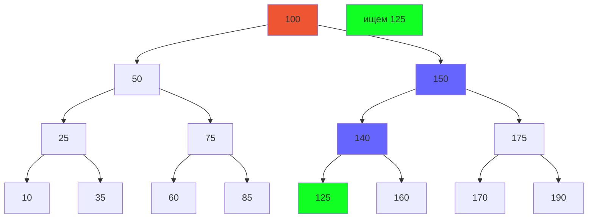

# Бинарный поиск

Алгоритм бинарного поиска является одним из наиболее эффективных алгоритмов поискав упорядоченном массиве. Упрощённо этот алгоритм состоит в следующем:
ключ поиска сравнивается с середним элементом массива и, если они равны, то поиск успешно заканчивается, иначе поиск аналогичным образом осуществляется в левой и правой половинах массива

##  Алгоритм бинарного поиска

Пусть имеется массив, значения которого упорядочеыны по возрастанию, т.е. $M1 ≤ M2 ≤...≤ Mn$. Необходимо найти элемент массива, равный заданному ключу поиска K.

##### Алгоритм A

``` C
1. L = 1
2. R = n
3. if (R < L) { return Failure() }
4. i = ceil((L + R) / 2)
5. if (K = M[i]) { return Success(i) }
6. if (K < M[i]) { R = i - 1; goto 3 }
7. /*if (K > M[i])*/ { L = i + 1; goto 3 }
```

^binary-search-impl-a

Для вычисления максимальной и средней сложности **Алгоритма А** представим упорядоченный массив в виде двоичного дерева поиска



В худшем случае необходимо пройти дерево до конечной вершины, т,е выполнить $log_2(N + 1)$ ^binary-search-impl-a-worst-calc

Среднее число сравнений при успешном поиске вычисляется по формуле $log_2(N - 1)$ ^binary-search-impl-a-average-calc

Сложность алгоритма $O(log(N))$

## Алгоритм оптимального бинарного поиска

В **Алгоритме А** [[#^binary-search-impl-a]] удачный поиск от неудачного в среднем отличается на одно сравнение[[#^binary-search-impl-a-worst-calc]][[#^binary-search-impl-a-average-calc]]
Основываясь на этом факте Вирт предложил упростить Алгоритм бинарного поиска убрав из цикла шаг 5 (т.е. проверку на равенство ключа элементу массива). Т.к. в этом случае поиск будет всегда неудачным, то убирается $log_2(N)$ сравнений, что является выигрышом