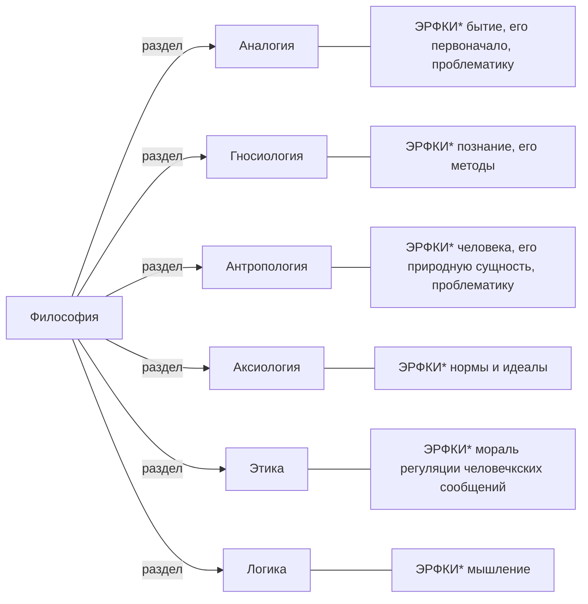

# План
* Философия, её предмет, цели и задачи
* * как период зарождения философии знаний
* Специфика
	* Понятие мировозренния
		* Компоненты мировозренния
		* Уровень мировозренния
	* Миф и религия как форма духовно-практического уровня мировозренния
	* Философия и наука как формы теоритического уровня мировозренния
* Функции философии

> *ЭРФКИ* - "это раздел философии который"

## Философия, её предмет, цели и задачи
> ...
## * как период зарождения философии знаний
> ...
## Специфика

**Мировоззрение** - это сложное синтетическое интегральное образование общественного и индивидуального сознания
**Мировоззрение** - это система оценок норм и установок, определяющих отношение человека к миру и выступающих в качестве ориентира и регулятора его поведения

**Миф** - особый вид мировозренния, спецефическое, образное, синкретическое представление о явлениях природы и коллективной жизни
* Космогамический - о том как всё получилось (примитивная Антология)
* Миф о герое
Главное значение **миф**ов состоит в том что они устанавливают законы меж мерами человека, природой и обществом, общества и индивида

**Религия** - культовая система(система обрядовых действий) направленное на регуляцию отношений со сверхестественным
* Функция религии заключается в том чтобы помочь человеку понять и принять происходящие

**Философия** - теоретическая форма мировозренния, представляющая собой систему общих взглядов на мир в целом, место в нём человека, уяснения различных форм человека к миру и человека к человеку
 
## Функции философии
* Мировоззренческая
* ~*Подход к науке?~
* Критическиая
* Аксиологическая
* Социальные
* Гуманитарная

